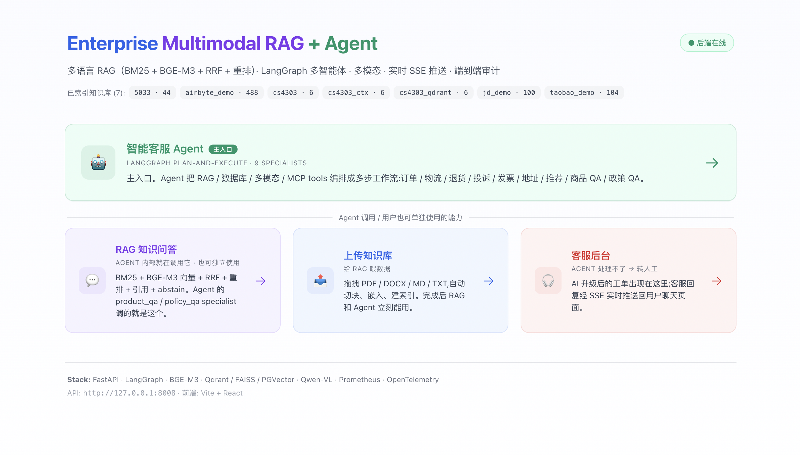
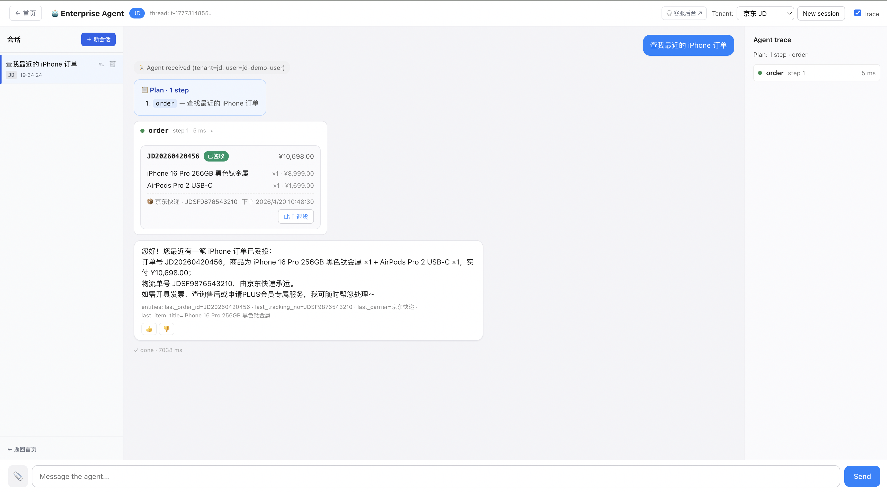
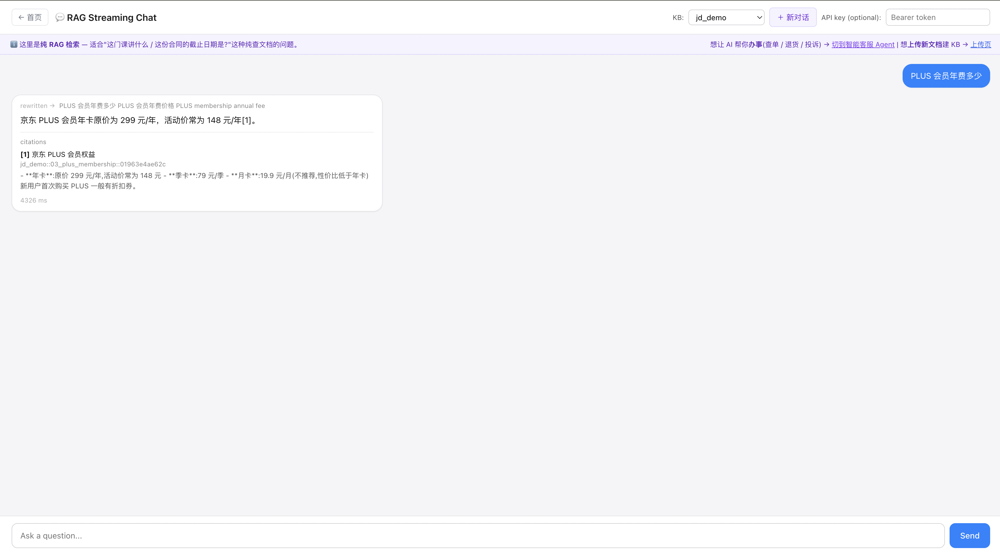
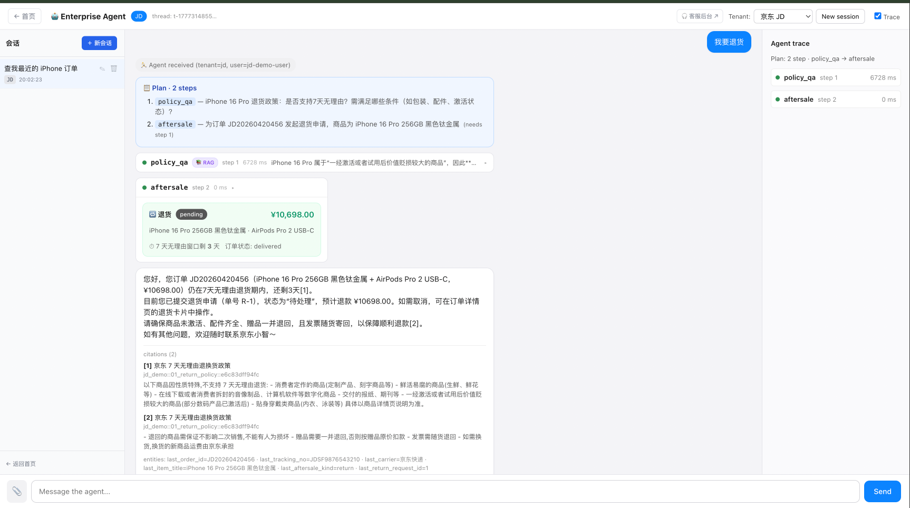
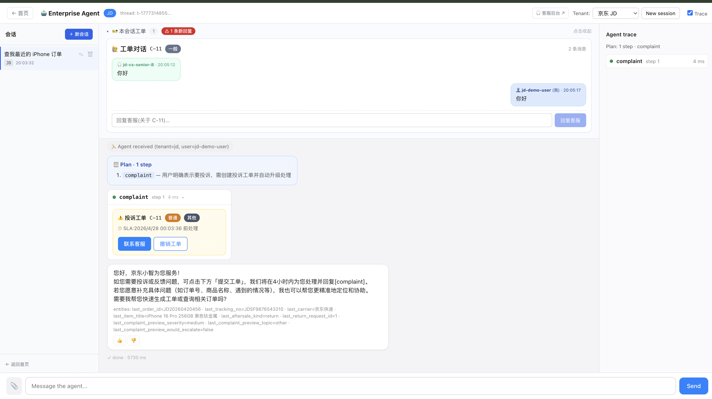
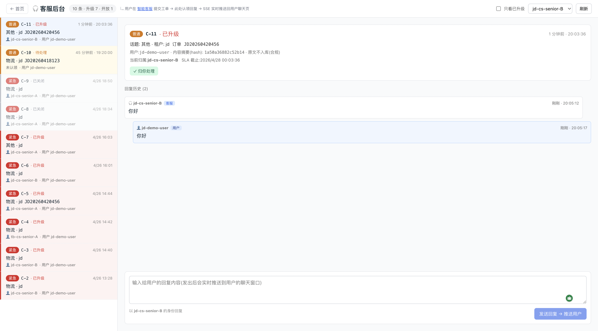
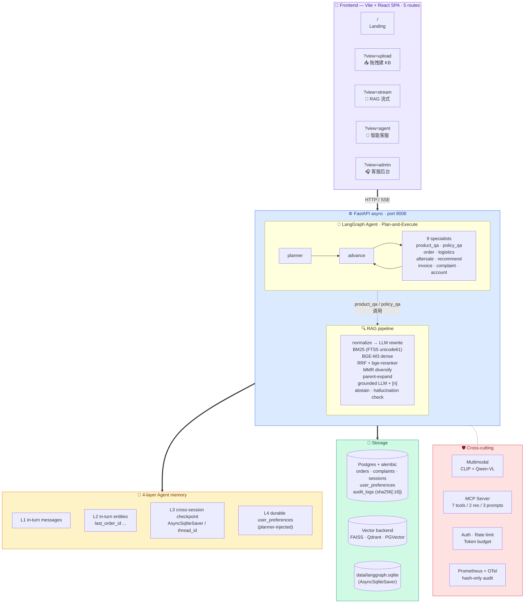

# Enterprise Multilingual RAG + Customer Service Agent Platform

**🌐 Languages**: English (this page) · [中文](./README.zh.md)


[](#)
[](#)
[](#)
[](#)
[](#)
[](#)

[](#)
[](#)
[](#)
[](#)
[](#)
[](#)
[](#)
[](#)
[](#)
[](#)
[](#)

A production-leaning **multilingual RAG platform** (CN + EN) with a **9-specialist
LangGraph customer service agent** layered on top, full session management,
real-time admin↔user SSE push, multimodal ingestion, and end-to-end audit.

> 同时支持纯 RAG 知识问答 + 任务型 Agent 客服。**Agent 把 RAG 当工具用**,
> 不是两个独立系统 —— 这是平台型 AI 产品的标准形态。

---

## 0. What this is, and why it exists

This is a **personal portfolio project** built to demonstrate end-to-end
engineering of a modern LLM application — not a toy chatbot, not a tutorial
follow-along. The target use case is **multi-tenant e-commerce customer
service**: a user asks anything from "what's the return policy" to "submit a
complaint about my order #JD20260420456 to 12315", and the platform answers,
acts, and persists state across sessions.

**Four capability pillars** — each with its own thought-out architecture:

| | What it does | Notable tech |
|---|---|---|
| **🤖 Agent** | Plans + executes multi-step business workflows across 9 specialist nodes | LangGraph StateGraph · Plan-and-Execute · 4-layer memory · AsyncSqliteSaver |
| **🔍 RAG** | Bilingual (CN+EN) hybrid retrieval with measured quality + ongoing regression-gating | BM25 (FTS5 unicode61) + BGE-M3 + RRF + bge-reranker + **Anthropic 2024 Contextual Retrieval** |
| **🖼 Multimodal** | Image search (text↔image), layout-aware ingestion of PPT/diagram | **CLIP** ViT-B-32 (512-d shared space) + **Qwen-VL** layout (title / text / table / figure / code) |
| **🔌 MCP** | Project capabilities exposed as a standard tool server | **Model Context Protocol** (Anthropic 2024 stdio) · 7 Tools + 2 Resources + 3 Prompts · Claude Desktop / Cursor compatible |

**Quality is measured, not asserted.** 84-row hand-curated eval set, CI
auto-blocks merges that drop Hit@5 / MRR by more than 0.02. **544 unit
tests** cover DB / API / SSE bus / agent flow / RAG retrieval / multi-turn
correctness.

**Multi-turn is done right** (3 layered fixes catching real bugs found in
live testing — [see Section 10](#10-differentiators-what-makes-this-not-a-toy)
for the full story):
- *Rewriter recency bias* — "translate that" anchors to the **most recent**
  assistant turn, not the earliest user question.
- *Intent router* — meta-questions ("刚刚翻译的是什么") skip RAG and answer
  from conversation history, fixing the "hallucinate a summary of arbitrary
  chunks" failure that plagues naive RAG.
- *Answerer-with-history* — the LLM sees the last 2 turns as **intent-only
  context**, with a system-prompt hard-rule that facts must come from
  `[n]`-cited chunks. No stale-answer drift.

---

## Screenshots

| | | |
|---|---|---|
|  |  |  |
| **Landing** — Agent 主入口 + RAG / 上传 / 客服后台 三副入口,首屏即看到 4 个已索引 KB | **Agent multi-step** — Plan-and-Execute 派发 `order` specialist,展开订单卡 + 4-layer memory 的 entities chip 可见 | **RAG streaming** — `rewritten →` 跨语言改写 + grounded LLM 答案 + 内联 `[n]` 引用 + 来源 chunk 展开 |
|  |  |  |
| **Aftersale flow** — `policy_qa` + `aftersale` 多 specialist 协作,弹出"此单退货"按钮,点击后 R-N 已提交 + DB 写入审计 | **Complaint ticket** — `complaint` specialist 干跑预览,用户点提交后真正落库 + 自动升级人工,工单卡内可双向对话 | **Admin console** — 客服后台工单队列(SLA / 升级标记)+ 双向气泡(用户↔客服)+ SSE 实时推送回用户聊天页 |

---

## 1. Architecture



---

## 2. Headline numbers

| Metric | Value | How |
|---|---|---|
| Retrieval Hit@5 (84-row eval) | **1.000** rewrite=on / **0.942** rewrite=off | BM25 + BGE-M3 + RRF + BGE-reranker + MMR |
| Retrieval MRR@10 | **0.878** rewrite=on | Same pipeline |
| Multi-hop bucket MRR | **0.971** | Contextual Retrieval prefixes |
| Answer faithful (LLM-as-judge) | **0.90+** | Grounded prompt + abstain |
| Test count | **544 passed**, 4 skipped, 1 deselected | `pytest -m "not integration"` |
| Backends | FAISS + Qdrant + **PGVector** | One `VectorStore` ABC |
| Specialists | **9** (Plan-and-Execute) | product_qa / policy_qa / order / logistics / aftersale / recommend / invoice / complaint / account |
| Frontend bundle | 226 KB / 71 KB gzip | Vite + React, 5 routes |

---

## 3. Quick start — 自己跑起来 (5 分钟)

> **🔑 Heads-up to anyone forking this repo**: this project calls **Qwen
> (Aliyun DashScope)** for LLM. You need **your own** `DASHSCOPE_API_KEY`
> — get a free one at https://dashscope.aliyun.com/. The repo itself
> contains **no API keys** (`.env.local` is gitignored).

### Option A — Local Python (recommended for evaluation)

```bash
# 1. Clone + install
git clone <repo> && cd enterprise-multimodal-copilot
python3.12 -m venv .venv
./.venv/bin/pip install -r requirements-api.txt

# 2. Configure your DashScope key (uncommitted, local only)
cp .env.example .env.local
#   then edit .env.local and fill in: DASHSCOPE_API_KEY=sk-your-key-here

# 3. Database migration + seed demo data (mocks: 2 users, 6 orders, ...)
./.venv/bin/alembic upgrade head
./.venv/bin/python scripts/seed_db.py

# 4. Start backend (port 8008)
./.venv/bin/python scripts/run_api.py &

# 5. Start frontend (port 5714)
cd frontend && npm install && npm run dev
```

### Option B — Docker one-shot

```bash
cp .env.example .env.local && edit .env.local   # fill DASHSCOPE_API_KEY
docker build -t rag-agent .
docker run --rm -p 8008:8008 --env-file .env.local rag-agent
# Frontend: cd frontend && npm install && npm run dev
```

The Dockerfile auto-runs `alembic upgrade head` on boot, so the DB schema is
always in sync. Frontend stays separate (Vite dev server).

Open `http://127.0.0.1:5714/` and you'll see the 4-card landing page.

**One-shot demo path** (5 min):
1. Click 📤 **上传知识库** → drag a PDF → KB built
2. Click 💬 **RAG 问答** → ask a question → grounded answer with `[n]` citations
3. Click 🤖 **智能客服** → "查我最近的 iPhone 订单" → multi-step plan + cards
4. Same chat: "我要去 12315 投诉" → preview card → click 提交工单
5. Open 🎧 **客服后台** in another tab → claim + reply → user's chat lights up via SSE

---

## 4. Capability list

### Core RAG
- ✅ **Multilingual** (CN + EN) ingestion + Q&A
- ✅ **Hybrid retrieval** — BM25 (SQLite FTS5, CJK-aware) + dense BGE-M3 + RRF
- ✅ **Cross-encoder rerank** (BGE-reranker)
- ✅ **MMR diversification** (Jaccard shingles)
- ✅ **Cross-lingual rewrite** + multi-query expansion (opt-in)
- ✅ **Conversation-aware coreference** ("那 PRO 呢" → resolves to "PLUS PRO")
- ✅ **Parent-child chunks** (small-to-big retrieval)
- ✅ **Contextual Retrieval** (Anthropic-style document-level prefixes)
- ✅ **Grounded answer** with inline `[n]` citations + two-layer abstain
- ✅ **Online hallucination verification** (opt-in, qwen-turbo verifies grounding per sentence)
- ✅ **Token-level streaming** (`/answer/stream` SSE)
- ✅ **Fallback chain** (Qwen → Claude → extractive)

### Vector backends (one ABC, three implementations)
- FAISS flat-IP (zero-dep, single file)
- Qdrant (memory / local file / HTTP)
- **PGVector** (Postgres extension)

### Ingestion
- PDF (PyMuPDF text-layer skip), DOCX, PPTX, XLSX, MD, TXT, HTML, JSONL
- Image files (PNG/JPG/WebP) → Qwen-VL describe + OCR
- HTML boilerplate strip (readability-lxml)
- PII redaction at ingest (CN phone / ID / bank[Luhn] / email / IP)
- MinHash dedup (0.85 threshold)
- Metadata enrichment (LLM entities / topics / date per chunk, opt-in)
- Semantic chunking (Greg Kamradt embedding-distance, opt-in)
- **Connectors**: local_dir, http_page, Notion (REST API)
- **Incremental ingest** (content-hash diff, add/update/skip/delete per doc)

### Multimodal
- Qwen-VL describe + OCR + layout analysis (title/text/table/figure/code regions)
- Multi-image input (5-image cap)
- Image embedding (CLIP ViT-B-32, 512-d shared text+image space)
- `/vision/search` — search KB by image

### Agent (LangGraph)
- **Plan-and-Execute** with 9 specialists
- **Native function calling** loop (OrderAgent v2)
- **MCP server** (7 tools / 2 resources / 3 prompts, stdio, Claude Desktop compatible)
- **4-layer memory**:
  1. In-turn `messages`
  2. In-turn `entities` (last_order_id / last_item_title / ...)
  3. Cross-session **AsyncSqliteSaver** checkpoint, keyed on `thread_id`
  4. **Long-term `user_preferences`** (durable, cross-session, planner-injected)
- **Reversible state machines**: complaint and return_request both support
  cancel ↔ reopen with severity-aware state restoration

### Real-time admin↔user loop
- **Customer service admin dashboard** (`?view=admin`)
- Complaint queue + claim + reply with author identity
- **SSE push** to user's open Agent chat (in-process bus, `Redis pub/sub` swappable)
- User-side bidirectional thread (admin replies + user replies in one card)
- Auto-poll on selected complaint for fresh user-side messages

### Safety / governance
- **Prompt injection defense** (EN + ZH, 13 patterns)
- **Output PII redaction** (`sk-...`, private keys, system-prompt leaks)
- **Audit log** with sha256[:16] hashes only (raw query/answer never in audit)
- **GDPR delete** (cascade across orders/items/return_requests/feedback/audit)
- **Retention cleanup** cron (audit 180d, feedback 365d, terminal returns 365d)

### Ops / observability
- Prometheus `/metrics` (5 metric families, low-cardinality labels)
- OpenTelemetry SDK + OTLP exporter (env-gated)
- 6-panel Grafana dashboard
- API key auth (sha256 hash, sliding-window rate limit per tenant)
- Per-request + per-tenant token budget
- Locust load test scaffold

### Frontend
- Vite + React, **one SPA, 5 routes**:
  - `/` — Landing (hero card + 3 supporting)
  - `?view=upload` — drag-drop file ingestion + KB build
  - `?view=stream` — RAG streaming Q&A
  - `?view=agent` — Multi-agent CS chat (sessions sidebar + ticket panel + trace)
  - `?view=admin` — Customer service ticket queue
- ChatGPT-style **session sidebar** (rename, delete, switch)
- Auto-rehydrate inbox on mount (admin replies that arrived offline)

### Evaluation
- **84-row hand-curated eval** (34 direct / 18 adversarial / 17 multi_hop / 15 OOD)
- Hit@1/3/5 + MRR@10 per category
- LLM-as-judge for answer quality (faithful / cites correctly / answers / abstain)
- **Regression gate** (CI fails on >0.02 metric drop, deterministic via rewrite=off)
- Thumbs-down → regression candidate pipeline

---

## 5. Project layout

```
src/
├── rag/                        # Stateless RAG core
│   ├── ingest/                 # Loaders + chunking + connectors + cleaning
│   ├── index/                  # FAISS / Qdrant / PGVector + BM25
│   ├── query/                  # Normalize + rewrite + multi-query
│   ├── retrieval/              # Hybrid + RRF + rerank + MMR + parent-expand
│   ├── answer/                 # Grounded LLM + abstain + fallback chain
│   │   └── hallucination_check.py    # qwen-turbo verifier
│   ├── nlp/emotion.py          # Complaint severity classifier
│   ├── vision/                 # Qwen-VL describe / OCR / layout / CLIP
│   ├── eval/                   # Retrieval + answer eval
│   ├── observability/          # Prometheus + OpenTelemetry
│   └── db/                     # SQLAlchemy models + Alembic
├── rag_api/
│   ├── main.py                 # FastAPI app + endpoints
│   ├── agent_routes.py         # SSE /agent/chat
│   ├── admin_routes.py         # CS admin queue
│   ├── user_events.py          # In-process SSE bus
│   ├── invoice_pdf.py          # ReportLab CJK invoice PDF
│   ├── auth.py                 # API key + tenant scoping
│   ├── audit.py                # Hash-only audit log
│   └── rate_limit.py           # Sliding window
agent/                          # LangGraph multi-agent
├── planner.py                  # Plan-and-Execute
├── coordinator.py              # Route + summary
├── graph.py                    # StateGraph + AsyncSqliteSaver
├── tool_calling.py             # OpenAI-compatible loop
├── specialists/                # 9 specialists
└── tools/                      # DB-backed tool functions
mcp_server/                     # MCP stdio server
frontend/src/                   # Vite + React, 5 routes
data/eval/                      # eval_rows.jsonl + baseline.json
scripts/                        # Build / sync / GDPR / regression gate
ops/grafana/                    # Dashboard JSON
```

---

## 6. Production-grade decisions explained

| Decision | Why |
|---|---|
| RAG is stateless, Agent ↔ RAG over HTTP | Test agent without KB; deploy RAG separately at scale |
| Async stack (FastAPI + AsyncSqliteSaver) | Non-blocking under load; matches LangGraph's `astream` model |
| Audit stores hashes only | Lessen blast radius if audit DB leaks; full text recoverable from app log via trace_id |
| Specialists dry-run, buttons commit | Mis-classified greetings don't write rows; user always confirms DB writes |
| Reversible state machines (complaint, return) | "Closed" actually closes (UI hidden + 409 on API); reopen restores severity-appropriate active state with new SLA |
| 4-layer Agent memory | Pass interview question "how do you handle multi-turn" with detail at every level |
| Strict per-session ticket scoping | Avoids cross-session leakage when admin replies arrive |
| Hash-only SSE event payload + thread_id | Frontend can route reply to correct session; defense in depth |

---

## 7. Tests + eval

```bash
# Full pytest (no LLM needed for ~470 of them)
./.venv/bin/pytest -m "not integration"

# Regression gate (deterministic, rewrite=off)
./.venv/bin/python scripts/regression_gate.py --offline

# Full retrieval eval (rewrite=on, default)
./.venv/bin/python scripts/run_eval.py --only retrieval

# Live SSE smoke (requires API running)
curl -N http://127.0.0.1:8008/users/jd-demo-user/events
```

CI runs pytest + the offline gate on every PR (`.github/workflows/ci.yml`).

---

## 8. Deployment & docs

- **Deployment** — see [docs/DEPLOY.md](./docs/DEPLOY.md) for one-click deploy to Render / Fly.io / Vercel.
- **Architecture decisions** — see [docs/ARCHITECTURE.md](./docs/ARCHITECTURE.md) for the 10 non-obvious design choices (Plan-and-Execute vs ReAct, 4-layer memory split, three-vector-backend ABC, dry-run specialists, etc.) — written in ADR style: the **decision**, **why over alternatives**, **what we'd revisit at scale**.

### ⚠️ If you deploy this publicly, lock it down first

This project ships with **anonymous open access by default** — fine for local
evaluation, **dangerous on the public internet** (anyone hitting your URL
burns *your* DashScope tokens). Before pushing to a public host:

```bash
# In your hosting platform's env vars (Render / Fly.io / Vercel):
REQUIRE_API_KEY=true               # require Bearer auth on protected routes
RATE_LIMIT_ENABLED=true            # sliding-window per-tenant
RATE_LIMIT_AUTHENTICATED=50/minute # tighten the default 200/min
RATE_LIMIT_ANONYMOUS=5/minute      # near-closed for anon
TENANT_TOKEN_BUDGET=200000         # tighten the default 1_000_000/min
MAX_PROMPT_TOKENS_PER_REQUEST=4096 # cap single-request prompt size
```

Then mint API keys per recipient via `python scripts/create_api_key.py`
and revoke them when no longer needed. Keys are stored as sha256 — the raw
key is shown only once at creation time.

For interview / portfolio demos, the **safest path is still local fork**
(your reviewer brings their own DashScope key, your key is never used). If
they don't have a key, point them at the **extractive fallback mode**
(`ENABLE_FALLBACK_CHAIN=true` + Qwen disabled) — answers are slightly less
fluent but **zero LLM calls**, so reviewing is free.

---

## 9. Troubleshooting (when running locally)

| Symptom | Likely cause | Fix |
|---|---|---|
| `pytest` fails on first run | DB schema not migrated | `./.venv/bin/alembic upgrade head` |
| `LLMError: DASHSCOPE_API_KEY not set` | Forgot to fill `.env.local` | `cp .env.example .env.local && edit .env.local` |
| `/answer/stream` returns `KB '...' has no built indexes` | KB not built yet | Upload a doc via `?view=upload`, or run `python scripts/build_kb.py <kb_id>` |
| Frontend shows blank page | Backend on wrong port | Confirm backend on `8008` (default), Vite proxies via `VITE_API_BASE` |
| Docker build pulls torch every time | First build only — 2-stage layer caches it | Subsequent builds reuse the wheels layer |
| `/answer` answers feel hallucinated on multi-turn meta-questions | Should be auto-fixed by intent routing | Verify `enable_intent_routing` in `src/rag/config.py` is `True` (default) |
| Want to evaluate without spending tokens | Use the extractive fallback | Set `ENABLE_FALLBACK_CHAIN=true` and unset `DASHSCOPE_API_KEY` — answers come from `[n]`-cited chunks via pure-Python sentence extraction |

---

## 10. Differentiators (what makes this not a toy)

1. **Real action endpoints, not just chat**. `/invoice/{id}.pdf` returns a 47 KB ReportLab PDF; `/agent/actions/*` writes audited DB rows with sha256-only retention. Buttons in the UI hit these directly.

2. **End-to-end agent + admin loop**. The Agent flags a complaint, the Admin Dashboard claims it, the admin's reply hits user's chat in real time via SSE — and the user replies back through the same bidirectional thread card. **Both directions actually work**, with cross-user spoof rejection on the API.

3. **All writes need explicit user/admin confirmation** (specialists are dry-run). A mis-classified greeting can't conjure a complaint ticket.

4. **Reversible state machines**. Both complaint and return_request support cancel ↔ reopen with API-layer 409 enforcement and per-severity SLA restoration.

5. **Observable**. Every request gets a trace_id, every business event gets an audit row (hashes only), Prometheus metrics + OpenTelemetry tracing on by env flag.

6. **Testable**. 544-row pytest covering DB / API / SSE bus / agent flow / RAG retrieval / hallucination check / sessions / preferences / multi-turn closure consistency / **3-way intent routing** / **rewriter recency bias** / **answerer last-2-turns context guard** / **status-aware order actions (cancel / escalate / return)**.

7. **Multi-turn done right (3 layered fixes)**.
   - **Rewriter** sees history with explicit *recency bias* — when the user says "translate that", the source is the **most recent** assistant turn, not the earliest user question (a real W02-L01 long-range coreference bug, fixed via prompt-engineering + 4 tests).
   - **Intent router** classifies each query as `meta` / `chitchat` / `kb` *before* retrieval — meta-questions ("刚刚翻译的是什么") skip RAG and answer from conversation history directly, fixing the "hallucinate a summary of arbitrary chunks" failure mode that plagues naive RAG.
   - **Answerer** sees the last 2 turns as *intent-only context* (system prompt hard-rule: facts must come from `[n]`-cited chunks), giving follow-up questions enough context without re-introducing stale-answer drift.

---

## License

MIT.
